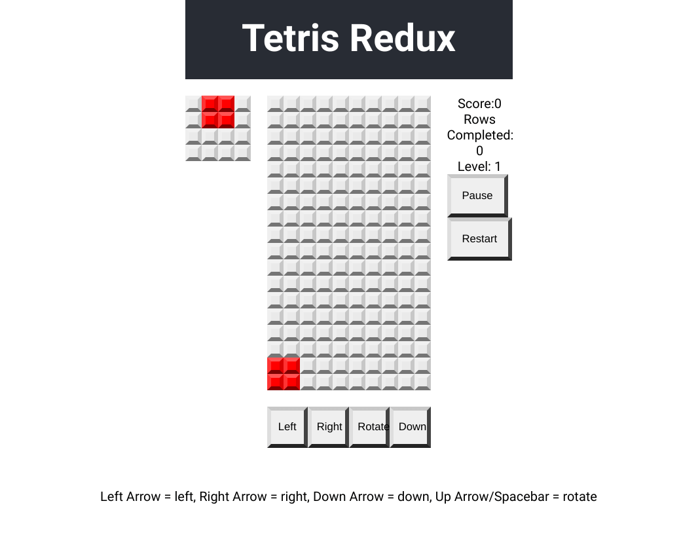

<h1 align="center">React Redux Tetris App</h1>

   Tutorial from  <a href="https://makeschool.org/mediabook/oa/tutorials/react-redux-tetris-app-tutorial-o4s/tetris-introduction/" target="_blank">makeschool.org</a>.

## Table of Contents

- [Overview](#overview)
  - [Built With](#built-with)
- [Features](#features)
- [Improvements](#improvements)
- [Useful Resources](#useful-resources)

## Overview

MakeSchool was a coding bootcamp that went under.  Most content was made free and I found this and decided to follow along.

[Live Link](https://jdegand.github.io/react-redux-tetris)

### Built With

- React
- Redux

## Features

- Working tetris game in browser.

## Improvements

- Difficulty Level
- Accessibility
- Local Storage for high scores / saving game state if accidently close the browser
- Use the lines completed or time lapsed from game start to raise level (speed) of the game 

### Useful Resources

- [W3 Schools](https://www.w3schools.com/jsref/jsref_fill.asp) - fill
- [Medium](https://medium.com/@wisecobbler/4-ways-to-populate-an-array-in-javascript-836952aea79f) - populate an array
- [YouTube](https://www.youtube.com/watch?v=YxsfJoKJZ50) - handling key press events in React
- [Pluralsight](https://www.pluralsight.com/guides/implement-keyboard-events-in-react) - keyboard events
- [Stack Overflow](https://stackoverflow.com/questions/41693715/react-redux-what-is-the-canonical-way-to-bind-a-keypress-action-to-kick-off-a-r) - react redux keypress events
- [Stack Overflow](https://stackoverflow.com/questions/2917175/return-multiple-values-in-javascript) - return multiple values